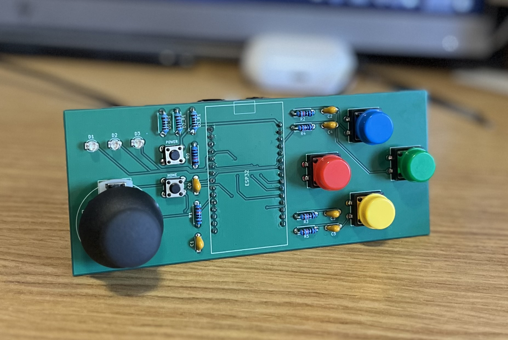

# ESP32 Game Controller

## Description:

A custom controller that provides a simple user interface with an ESP32 in the form of several buttons and a joystick. This board was designed for my ["LightsHack" project](https://github.com/luke-wagner/LightsHack), but could serve many other applications where an ESP32 controller is needed. This PCB is compatible only with the 30-pin development board in docs/esp32.jpg. This is important as the pinouts differ among the versions of these development boards. A board with a different pinout may not work as expected.

## Version 1.0

